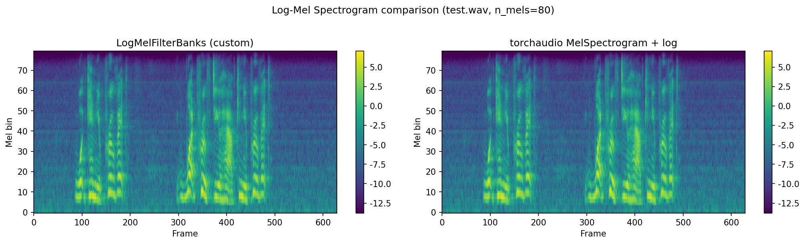
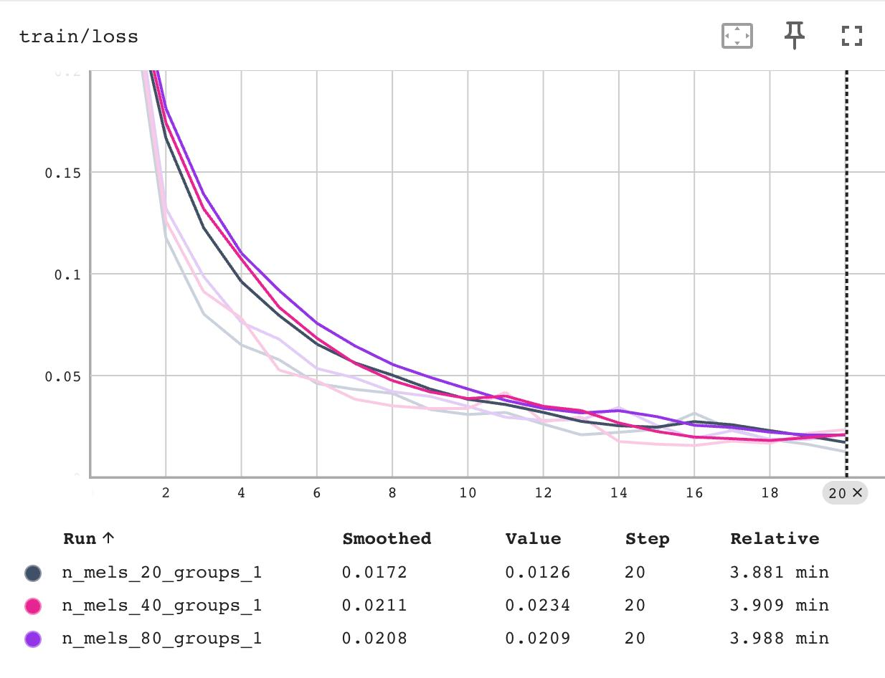
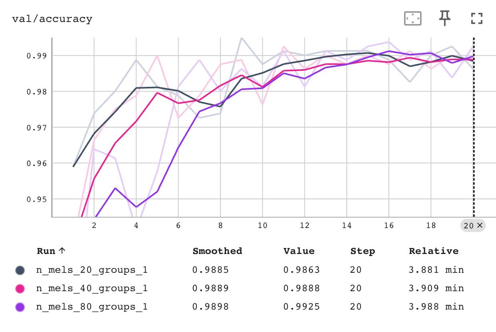
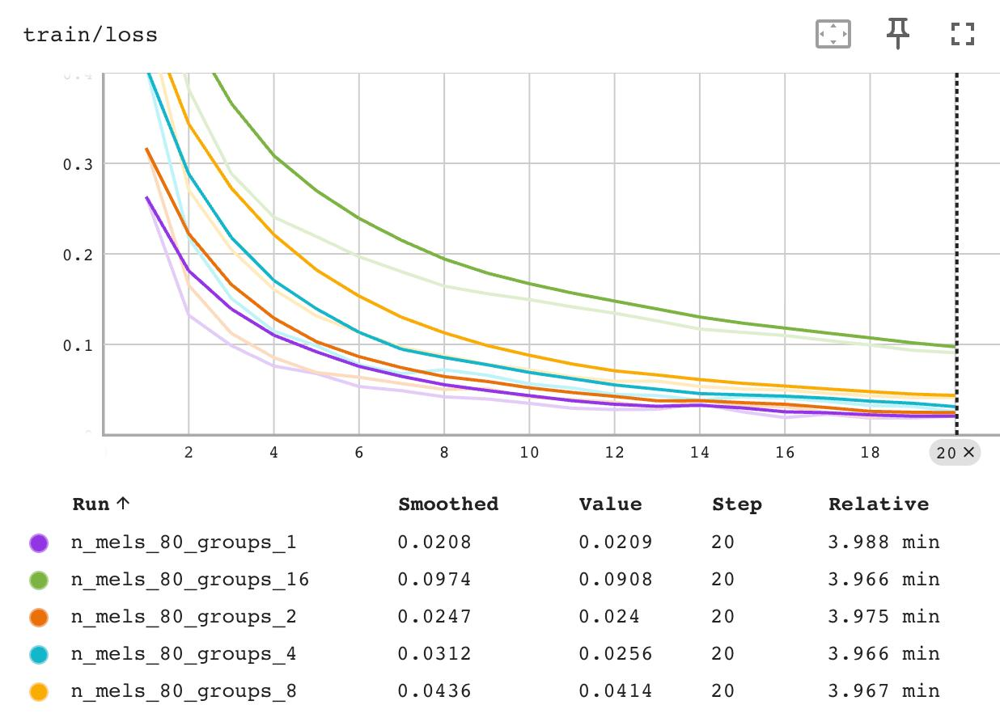
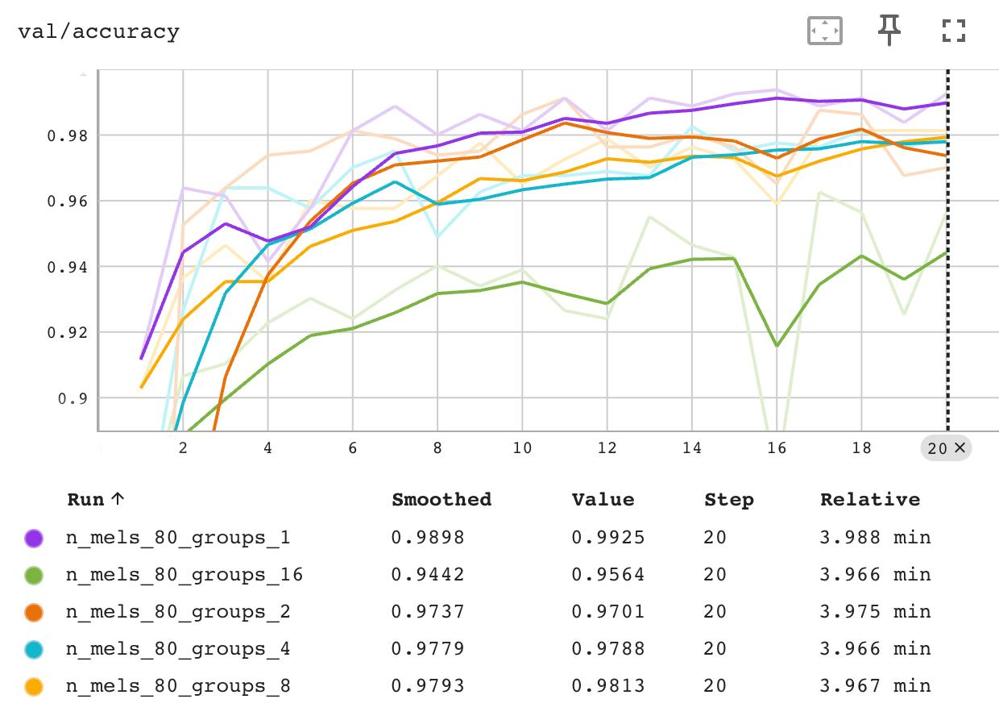
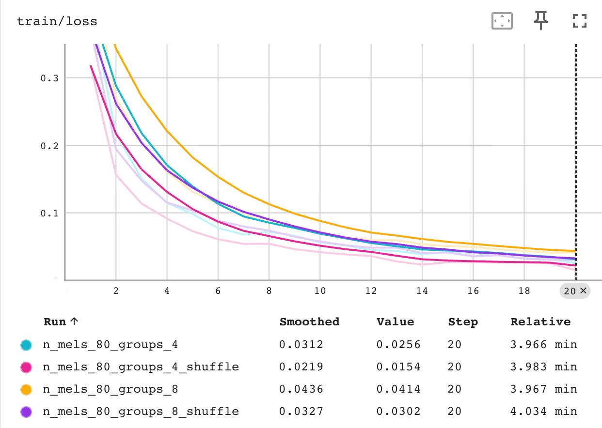
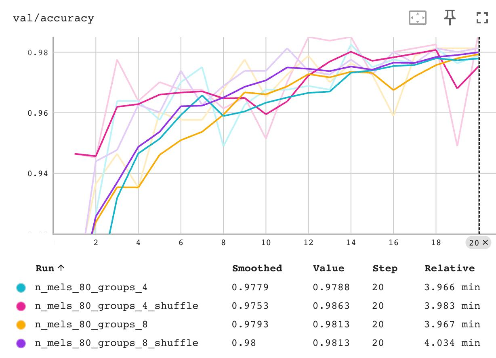

# LogMelFilterBanks validation

The custom `LogMelFilterBanks` layer was validated against the native `torchaudio.transforms.MelSpectrogram` on `test.wav` (16 kHz). 

# YesNoSpeechCommands classification

## Exps plan

| # | Variable | Value | Goal |
|---|-----------|----------|------|
| 1 | n_mels | 20, 40, 80 | n_mels vs accyracy |
| 2 | groups (n_mels=80) | 1, 2, 4, 8, 16 | changing of FLOPs/params via grouped convs|
| 3 | groups + shuffle (n_mels=80) | 2, 4, 8, 16 | compensation of groups loss via channel shuffle |

## Exp1: baseline with n_mels

### Results

| n_mels | Test Accuracy (%) | Params | FLOPs |
|--------|-------------------|--------|-------|
| 20     |    0.9964         | 22,818 | 2,311,808      |
| 40     |    0.9964         | 26,658 | 3,087,488      |
| 80     |    0.9951         | 34,338 | 4,638,848      |

### Conclusion

n_mels=20 performs better, has less params and flops, but i choosed n_mels=80 as a baseline for more comprehensive ablation study with group convs (2, 4, 8, 16) and shuffle param. 

## Exp2: grouped convolutions

### Results

| Groups | Test Accuracy (%) | Params | FLOPs | Δ FLOPs vs g=1 (%) |
|--------|-------------------|--------|-------|---------------------|
| 1      | 0.9951 | 34,338 | 4,638,848 | —      |
| 2      | 0.9818 | 17,442 | 2,319,488 | −50.0% |
| 4      | 0.9782 |  8,994 | 1,159,808 | −75.0% |
| 8      | 0.9745 |  4,770 |   579,968 | −87.5% |
| 16     | 0.9684 |  2,658 |   290,048 | −93.7% |

### Conclusion

Grouped convolutions provide a nearly linear trade-off between computational cost and accuracy. Doubling the number of groups halves the FLOPs while reducing accuracy by roughly 0.4–0.7 percentage points per step. Even at groups=16, where FLOPs are reduced by 93.7% and parameter count drops from 34K to just 2.6K, the model still retains 96.8% accuracy — only 2.7% below the baseline. This confirms that for a binary classification task the standard convolution is heavily over-parameterized.

## Exp3: channel shuffle effect

### Results

| Groups | Accuracy без shuffle (%) | Accuracy с shuffle (%) | Δ Accuracy |
|--------|--------------------------|------------------------|------------|
| 2      | 0.9818 | 0.9867 | +0.49% |
| 4      | 0.9782 | 0.9903 | +1.21% |
| 8      | 0.9745 | 0.9806 | +0.61% |
| 16     | 0.9684 | 0.9709 | +0.25% |

### Conclusion

Channel shuffle consistently improves accuracy across all group sizes, confirming that inter-group information exchange is beneficial. The largest gain is observed at groups=4 (+1.21%), where shuffle brings accuracy to 99.03% — nearly matching the ungrouped baseline (99.51%) while using only 25% of its FLOPs. For groups=2 and groups=8 the improvement is moderate (+0.49% and +0.61% respectively). At groups=16 the effect is smallest (+0.25%), suggesting that with very aggressive grouping the representational bottleneck becomes too severe for shuffle alone to compensate.

## Overall

### Best configs

| Criterion | Configuration | Test Accuracy (%) | FLOPs |
|-----------|--------------|-------------------|-------|
| Best accuracy   | n_mels=80, groups=1           | 99.51 | 4,638,848 |
| Best trade-off  | n_mels=80, groups=4, shuffle  | 99.03 | 1,159,808 |
| Min FLOPs       | n_mels=80, groups=16, shuffle | 97.09 |   290,048 |

For a binary yes/no speech command classification task, increasing mel frequency resolution beyond 20 bands yields no accuracy gain — all three n_mels settings achieve ~99.5%. Grouped convolutions effectively reduce computational cost: each doubling of groups halves FLOPs at the expense of only ~0.5% accuracy. Channel shuffle partially recovers this loss by restoring cross-group feature interaction, with the sweet spot at groups=4 + shuffle (99.03% accuracy at 75% FLOPs reduction). I would choose the groups=4 + shuffle configuration as for prod ready solution because it offers the best accuracy-efficiency trade-off, while groups=16 + shuffle provides a viable option when extreme compression (16x FLOPs reduction) is required with only a 2.4% accuracy penalty.
